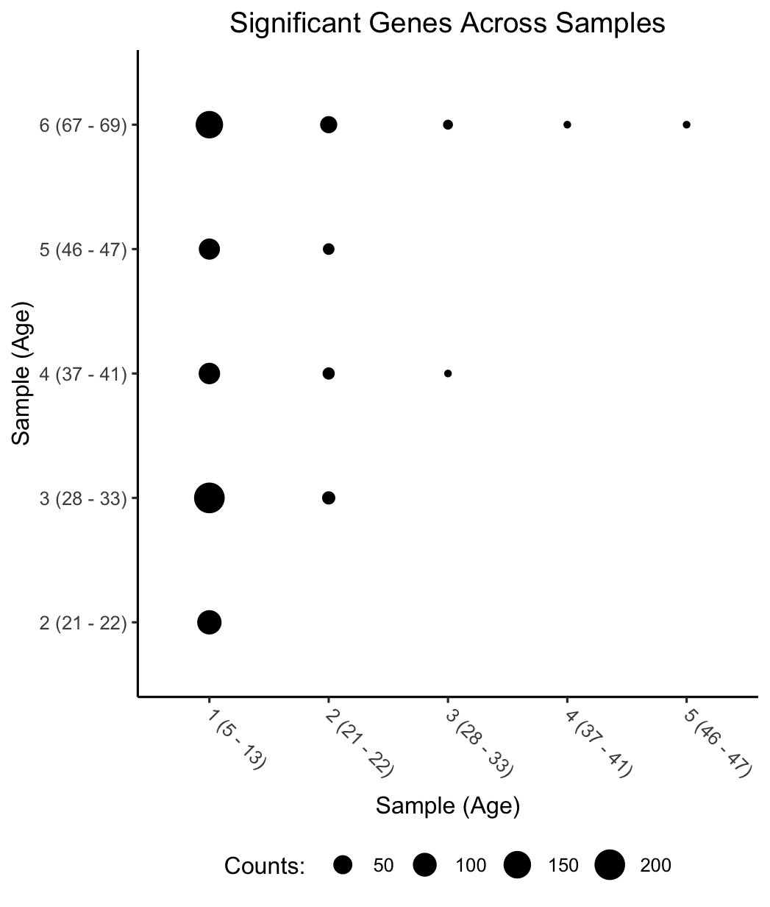
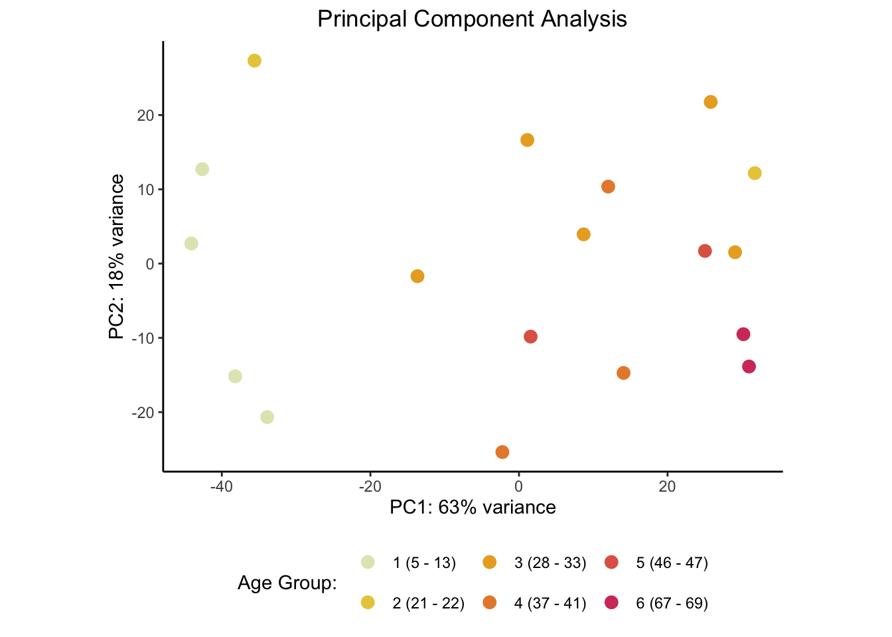
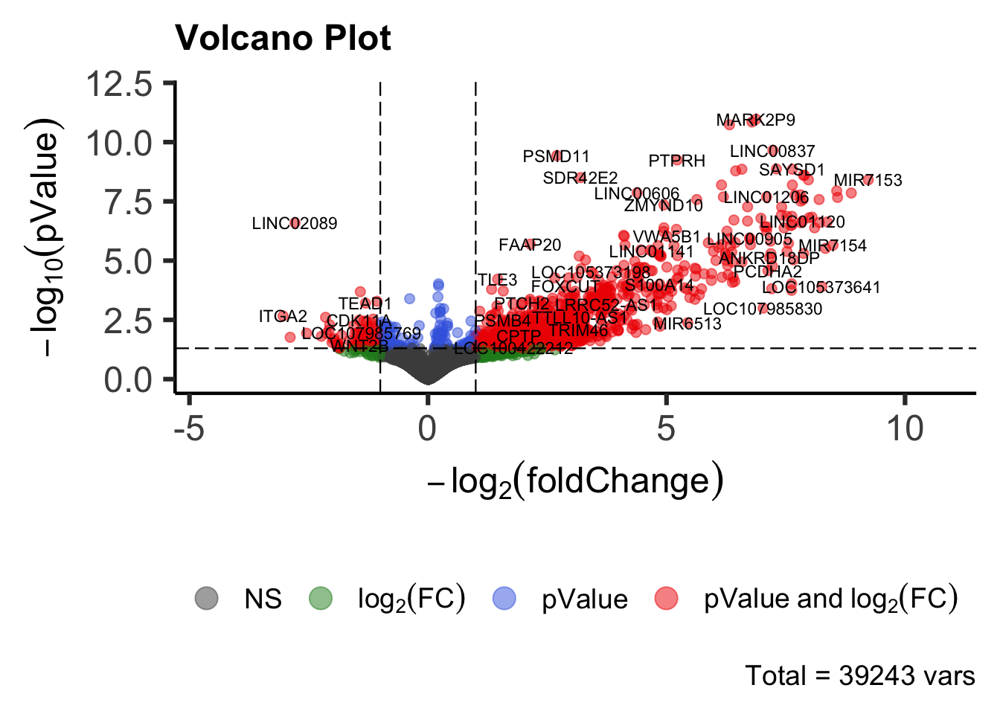

```{r setup, include = FALSE}
knitr::opts_chunk$set(echo = TRUE)
```

# Introduction

Non-coding RNAs ('ncRNAs') are a class of RNAs enveloping all RNAs which do not serve as the progenitor for proteins (Kaikkonen et al., 2011). Of the genetic material transcribed into RNAs, some 98%-99% of those transcripts fall within this broad category (Kaikkonen et al., 2011). Circa 2024, there are two major classifications of ncRNAs: infrastructural/housekeeping and regulatory (Zhang et al., 2019). Embraced within the former are both famous RNAs in the likes of ribosomal RNAs ('rRNAs') or transfer RNAs ('tRNAs') and lesser-known small-nuclear RNAs ('snRNAs') or small-nucleolar RNAs ('snoRNAs'). The latter is divided further yet into the nonexclusive categories: small non-coding RNAs ('sncRNAs') and long-non-coding RNAs ('lncRNAs'). The 'small' categorisation is the more prevalent of the two with micro RNAs ('miRNAs'), small-interfereing RNAs ('siRNAs') and piwi-interacting RNAs ('piRNAs') falling under its umbrella with promoter-associated transcripts ('PATs'), enhancer RNAs ('eRNAs'), and circular RNAs ('circRNAs') additionally sometimes classified as as much (Zhang et al., 2019). In terms of structure and function, these ncRNAs generally play by their own rules with vast differences including in fundamental structure (e.g., single v. double stranded) between seemingly similar categories (Kaikkonen et al., 2011).

Despite the ubiquity of these RNAs, much about them remains unclear (Wagner et al., 2024). One such behaviour shrouded in mystery concerns how the transcriptomic profile of ncRNAs varies, if at all, in the male testes at various ages. It is hypothesized that some differences will exist - likely attenuation of expression of them as has been seen in other ncRNAs (Wagner et al., 2024).

# Results

Through the methods detailed hereunder, this analysis was able to offer evidence that: (i) there is minor age-associated (if not age-based) variation in the ncRNA landscape, (ii) that variation is more strongly present when comparing younger population to older populations, and (iii) the variation is mainly a *decrease* in expression, and (iv) the genes varying with age are those implicated in running interference on translation of some mRNAs into proteins.

Buttressing such conclusions are the figures and tables following:

For (i):


For (ii):


For (iii):


For (iv):


| ID         | Description                                        | GeneRatio | BgRatio   | pvalue       | p.adjust   | qvalue      | geneID                                           | Count |
|------------|----------------------------------------------------|-----------|-----------|--------------|------------|-------------|--------------------------------------------------|-------|
| GO:1903231 | mRNA base-pairing translational repressor activity | 7/82      | 207/18005 | 4.396387e-05 | 0.00852899 | 0.007635829 | 554213/407017/406890/406949/442904/406987/407053 | 7     |
| GO:0030371 | translation repressor activity                     | 7/82      | 238/18005 | 1.057221e-04 | 0.01025505 | 0.009181131 | 554213/407017/406890/406949/442904/406987/407053 | 7     |

## Future Directions

There are a multitude of directions upon which future analyzes could proceed. Given transcriptomic profiles are context specific, it would be interesting to characterize similar expression profiles in other tissue which could yield insight into whether these ncRNAs have syntenic effects on tissues/organs.

## Limitations

This analysis does suffer from a few limitations:

1. Some of the reagents used by the Özata et al. were explicitly designed to stop certain ncRNAs (e.g., some siRNAs) from entering the library thereby limiting the scope of ncRNAs analyzed from the universe of them to some possibly-quite-narrower subset.

2. Choices of certain methods - e.g., using an aggressive Family-wise Error Rate Bonferroni correction instead of a meeker False Discovery Control like Benjamini-Hochberg, may have unnecessarily excluded genuinely significant ncRNA expression trends over age. In sum, the methods chosen undoubtedly introduced a  degree of bias onto the data.

# Discussion

Suffice it to say, this analysis revealed the raft of complexities surrounding what is, prima facie, a simple task. Many difficulties ensnared this analysis; by no means, however, did any of those difficulties prove fatal. Among the difficulties were:

1. The frequency of ambiguous decisions needed to be made to analyze the data. The application of the methods used hereunder were by no means ineluctable. Each step in this assignment required a critical analysis of the data and whether it was appropriate to apply a particular method. Quite frankly, this is not all that common an occurrence.

2. Some of the data did present a challenge - likely because it was ncRNA-seq as opposed to RNA-seq. For example, there were comparatively many more unassigned reads. To remedy this, `featureCounts` was used with fractional assignment enabled, so expected (since the ncRNAs are often so short) multimapped reads were still represented in the downstream analysis.

# Methods

The realisation of the results aforementioned occurred through a custom pipeline consisting of in-house scripts leveraging well established bioinformatics tools. The pipeline had six segregated, sequential phases: (i) Read Download, (ii) Genome Indexing, (iii) Read Alignment, (iv) Quality Control, (v) Feature Counting, and (vi) Data Analysis.

## Read Download

The download script (`download.py`) was a custom script which takes a list of *SERIES* accession ids. Scraping the NCBI's GEO platform, the script extricates, via the `BeautifulSoup` library, the corresponding *SAMPLES* SRA accession ids, thereinafter the SRR accession ids, where the library and species were - customizable though defaulting to, ncRNA-seq and Homo sapiens respectively. Equipped with the SRR accession ids, the script then established, in a multithreaded manner, FTP connections to ENA to download the relevant `fastq` read files.

This approach was preferable for multiple reasons including that: (i) the invidious uncompressing behaviour of `fasterq-dump` could be side-stepped (without wasting computational resources to recompress the read files) (ii) using a light-weight thread pool to download the files ensured downloading was *consistently* parallel (as opposed to the fork-background-wait approach common in bash which could theoretically be held up by a single download in a batch taking extensive time), and (iii) the script was idempotent and could be repeatedly and produce the same result.

## Genome Indexing

The genome indexing script (`index.sh`) was likewise a custom script which retrieved the T2T-CHM13v2.0 assembly ('T2T Genome', 'T2T Assembly') from the NCBI via CURL. The resultant zipfile was thereafter uncompressed wherein the sequence `fna` file and annotation `gtf` file were plucked out while the rest of the output was binned. Afterwards, `STAR` (version 2.7.11a) was run with appropriate, perfunctory arguments to generate the index. 

## Read Alignment

Equipped with an indexed genome, the downloaded reads were aligned to that index via a custom alignment script (`align.py`) which using a process pool simply invoked `STAR` (version 2.7.11a) to align the `fastq` read files to the `fna` genome file. Non-perfunctory parameters were included to (i) toss excessively multi-mapped reads (i.e., those with >= 20 mapped regions) as they were adjudged uninformative to downstream analysis, (ii) generate only `BAM`-SortedByCoordinate files as their binary sorted nature are more efficient for downstream analysis, and (iii) to limit SAM attributes to those parameters relevant for subsequent tools.

This approach was preferable for the same reason as `Read Download::(ii)` in that the process pool ensured a *consistent* multi-pronged approach to read alignment.

Thereafter, a second alignment index script (`align.sh`) was run to create indexes upon the alignment `BAM` files to allow random access into them - offering a speed boost to subsequent tools, via `samtools` (version 1.18).

## Quality Control

Those read alignments were subsequently interrogated to ensure they were of sufficient quality to permit analysis to proceed. First, `FastQC` (version 0.12.1) was run upon all the read files - the output of which was unified via `MultiQC` (version 1.17). After having investigated the results thereof and determined that trimming was warranted, `Trim-Galore` (version 0.6.10) run upon the reads which produced, in addition to the trimmed files, associated `FastQC` files. The stringency was set to three to avoid overzealous trimming of the sequence. Once more, `MultiQC` (version 1.17) was run upon the this-time-trimmed quality control files to unify those reports for ease of inspection.

## Feature Counting

With a green light from the quality control stage, feature counting was performed via a simple wrapper script (`counts.sh`) which in turn invoked `featureCounts` (version 2.0.6) upon the trimmed read files. Perfunctory parameters were passed for speed and convenience in output. 

## Data Analysis

Data analysis was performed hereafter in the enclosing file or - likely, rather its markdown progenitor (`Analysis.Rmd`).

### Library Loading

The following libraries were loaded first for convenience in subsequent invocation. They do not comprise an exhaustive list of dependencies as some invocations were made using fully qualified names (e.g., `library::module(...)`).

```{r, message = FALSE, warning = FALSE}
library(DESeq2)
library(clusterProfiler)
library(ggdendro)
library(gridExtra)
library(org.Hs.eg.db)
library(patchwork)
library(pheatmap)
library(scales)
library(vsn)

library(janitor)
library(zeallot)
library(tidyverse)
library(magrittr)
```

### Metadata Reading

The pertinent metadata concerning the samples were solely the age of the subjects. Rather than resorting to a dichotomous juvenile-adult categorization as the corresponding paper did (lumping the 5-13 year olds into one category and the 21-69 year olds into the other), the samples were clustered into 6 $(= \frac{18}{3})$ groups by way of the k-Means Clustering Algorithm. This allowed a more robust analysis than that in corresponding paper.

```{r}
set.seed(0)

runs.ages = (
  read.csv("SraRunTable.csv")
  |>  clean_names()
  |>  filter(assay_type == "ncRNA-Seq" & organism == "Homo sapiens")
  %>% {set_names(.$age |> str_extract("[^-]+") |> as.numeric(), .$run)}
  |>  sort()
)

runs = names(runs.ages)

runs.clean_names = (
  str_glue("{runs %>% str_replace(fixed(lcPrefix(.)), '...')} ({runs.ages})")
  |> set_names(runs)
)

runs.buckets = 6
runs.cluster = (
  runs.ages
  |>  kmeans(centers = runs.buckets)
  # The following ensures the assigned clusters are consistently well ordered, so cluster_i < cluster_j <=> i < j
  %>% {set_names(1:runs.buckets, .$centers[,1] |> sort() |> names())[.$cluster |> as.character()]}
  |>  set_names(runs)
)
runs.cluster.clean_names = (
  data.frame(ages = runs.ages, cluster = runs.cluster)
  |>  summarise(name = str_glue("{cur_group()} ({min(ages)} - {max(ages)})"), .by = cluster)
  %>% {set_names(.$name, .$cluster)}
)

ORDER = \(run) reorder(runs.clean_names[run], runs.ages[run])
```

### Read Assessment

The reads were initially assessed via the summary file created by `featureCounts`. A barplot was made showing the frequencies of the categories in which the reads were assigned.

```{r}
(
  read.table("counts.txt.summary", header = TRUE, row.names = 1)
  |> rename_with(str_extract, pattern = "[^_]+")
  |> filter(if_any(everything(), ~. != 0))
  |> t()
  |> as.data.frame()
  |> rename_with(~str_replace(., fixed("Unassigned_"), "") |> recode(Ambiguity = "Ambiguous"))
  |> rownames_to_column("run")
  |> pivot_longer(-run)
  |> ggplot(aes(x = ORDER(run), y = value, fill = name))
   + geom_bar(stat = "identity", position = "dodge")
   + scale_y_log10(labels = label_number())
   + labs(title = "Read Assignments", x = "Sample (Age)", y = "Count", fill = "Assignment: ")
   + theme_minimal()
   + theme(
     plot.title   = element_text(hjust = .5),
     axis.line    = element_line(colour = "black", linewidth = .5),
     legend.title = element_text(hjust = .5),
     legend.position = "bottom"
   )
   + coord_flip()
)
```

Turning to the full data, the counts of the genes per sample were loaded...

```{r}
dataset = (
  read.table("counts.txt", header = TRUE, row.names = 1)
  |>  rename_with(str_extract, pattern = "[^_]+", .cols = ends_with("bam"))
  |>  select(!(Chr:Length))
  |>  filter(if_any(everything(), ~. != 0))
  |>  relocate(all_of(runs))
  %>% DESeqDataSetFromMatrix(
    colData = data.frame(bucket = runs.cluster[colnames(.)] |> factor())
              |> mutate(bucket_range = runs.cluster.clean_names[bucket]),
    design = ~bucket
  )
)
```

..., and the total count of the reads of each sample was plotted.

```{r}
(
  colSums(counts(dataset))
  |> as.data.frame()
  |> set_colnames("counts")
  |> rownames_to_column("run")
  |> ggplot(aes(x = ORDER(run), y = counts))
   + geom_col()
   + labs(title = "Gene Counts", x = "Sample (Age)", y = "Counts")
   + scale_y_continuous(labels = label_number(scale = 1e-6, suffix = "M"))
   + theme_minimal()
   + theme(
     plot.title   = element_text(hjust =  .5),
     axis.text.x  = element_text(angle = -45, hjust = -.15, vjust = 1),
     axis.title.x = element_text(vjust = -.5),
     axis.title.y = element_text(vjust =  .5)
   )
)
```

### Data Normalisation

Satisfied with the preliminary assessment, the data were normalised to facilitate inter-group comparison. First, the size factors were computed and plotted against the library size to gauge the appropriateness and need for as much.

```{r}
dataset %<>% estimateSizeFactors

(
  data.frame(sf = sizeFactors(dataset), lib = colSums(counts(dataset)))
  |> ggplot(aes(x = sf, y = lib))
   + geom_point()
   + scale_y_continuous(labels = label_number(scale = 1e-6, suffix = "M"))
   + labs(x = "Size Factor", y = "Library Size")
   + theme_classic()
   + theme(plot.title = element_text(hjust = .5))
)
```

Thereafter, the data were actually normalised and log transformed with accompanying boxplots made to evidence success of those methods.

```{r}
assay(dataset, "log_counts") = log2(counts(dataset, normalized = FALSE) + 1)
assay(dataset, "log_norm_counts") = log2(counts(dataset, normalized = TRUE) + 1)

(
  assay(dataset, "log_norm_counts")
  |> set_colnames(runs.clean_names)
  |> stack()
  |> ggplot(aes(x = ORDER(col), y = value))
   + geom_boxplot()
   + labs(
     title = "Size-Factor-Normalised Read Counts",
     x = "Sample (Age)",
     y = expression(log[2]~(normalisedCounts~~+~1))
   )
   + theme_classic()
   + theme(
     plot.title   = element_text(hjust =  .5),
     axis.text.x  = element_text(angle = -45, hjust = -.15, vjust = 1),
     axis.title.x = element_text(vjust = -.5),
   )
)
```

Thence, the data was rlog transformed to taper the magnitude of the log counts of genes with extremely low expression. Evidence of success was displayed for a single pair samples.

```{r}
dataset.rlog = rlog(dataset, blind = TRUE)

(
  assay(dataset.rlog)
  |> extract(,c(1, 2))
  |> plot(cex = .1, main = "rlog Counts", xlab = runs.clean_names[1], ylab = runs.clean_names[2])
)
```

Lastly, the mean-standard deviation was analyzed via an SD-plot to determine whether the data were heteroskedastic or not.

```{r}
(
  list(assay(dataset, "log_norm_counts"), assay(dataset.rlog))
  |> imap(~
     meanSdPlot(.x, ranks = FALSE, plot = FALSE)$gg
     + labs(
       title = if (.y == 1) expression(log[2](normalisedCounts~+ 1)) else "rlog",
       x = "Mean",
       y = "Standard Deviation"
     )
     + guides(fill = guide_colourbar(title = "Count: "))
     + coord_cartesian(ylim = c(0, 5))
     + theme_minimal()
     + theme(
       plot.title = element_text(size = 12, hjust = .5),
       axis.line  = element_line(colour = "black", linewidth = .5),
     )
  )
  |> reduce(`+`)
   + plot_layout(guides = "collect")
   + plot_annotation(title = "Sequencing Depth")
   & theme(
     plot.title   = element_text(hjust = .5),
     legend.title = element_text(hjust = .5),
     legend.position = "bottom"
   )
)
```

### Clustering Assessment

With the data demonstrably ripe for comparison, various clustering methods were applied to adjudge whether the data had agglomerated in a manner expected. First, correlations were plotted as a heatmap wherein the column and row labels facilitated comparison.

```{r}
correlation = assay(dataset.rlog) |> cor(method = "pearson")

(
  as.dist(1 - correlation, upper = TRUE)
  |>  as.matrix()
  %>% set_colnames(runs.clean_names[colnames(.)])
  %>% set_rownames(runs.clean_names[rownames(.)])
  |>  pheatmap(main = "Pearson Correlation", treeheight_row = 0)
)
```

The dendrogram overlooking the heatmap was then enhanced for interrogation on its lonesome.

```{r}
(
  as.dist(1 - correlation)
  |>  hclust()
  |>  as.dendrogram()
  |>  dendro_data(type = "rectangle")
  %>% {(
      ggplot(segment(.))
      + geom_segment(aes(x = x, y = y, xend = xend, yend = yend))
      + geom_text(
        aes(x = x, y = y, label = runs.clean_names[label], hjust = 0, vjust = -.01),
        data = label(.)
      )
      + scale_y_reverse(expand = c(.2, 0))
      + labs(title = "rlog Read Counts Dendrogram", x = "Sample (Age)", y = "Gene Expression")
      + theme_classic()
      + theme(
        plot.title   = element_text(hjust = .5),
        axis.line.y  = element_blank(),
        axis.text.y  = element_blank(),
        axis.ticks.y = element_blank(),
        axis.title.x = element_text(vjust = .5),
        axis.title.y = element_text(angle = 90, vjust = .5)
      )
      + coord_flip()
  )}
)
```

Finally, a Principal Component Analysis was performed to check whether the data were segregating based upon age along the components best explaining the variance within the data.

```{r, message = FALSE}
(
  dataset.rlog
  |> plotPCA(intgroup = "bucket_range")
   + scale_colour_manual(values = rev(colorspace::heat_hcl(runs.buckets)))
   + labs(title = "Principal Component Analysis", colour = "Age Group: ")
   + theme_classic()
   + theme(
     plot.title = element_text(hjust = .5),
     legend.position = "bottom"
   )
)
```

### Differential Gene Expression Analysis

Arriving at the pith and substance of paper, the differentially expressed genes were identified via `DESeq`.

```{r, message = FALSE}
dataset %<>% DESeq

dataset.tests_performed = (
  combn(
    unique(runs.cluster), 2,
    \(groups) (
      dataset
      |> results(contrast = c("bucket", groups), alpha = .05)
      |> use_series(pvalue)
      |> discard(is.na)
      |> length()
    )
  )
  |> reduce(`+`)
)

dataset.results = (
  combn(
    unique(runs.cluster), 2,
    \(groups) (
      dataset
      |> results(contrast = c("bucket", groups), alpha = .05)
      |> as.data.frame()
      |> filter(!is.na(pvalue))
      |> mutate(padj = pmax(pmin(pvalue * dataset.tests_performed, 1), 0))
      |> add_column(base = groups[1], comparator = groups[2])
      |> rownames_to_column("gene")
    ),
    simplify = FALSE
  )
  |> reduce(rbind)
)
```

The frequency of significance was analyzed per combination of age groups to discern trends.

```{r}
(
  dataset.results
  |> filter(padj < .05)
  |> mutate(base = runs.cluster.clean_names[base],
            comparator = runs.cluster.clean_names[comparator])
  |> summarise(count = n(), .by = c(base, comparator))
  |> as.data.frame()
  |> ggplot(aes(x = base, y = comparator))
   + geom_point(aes(size = count))
   + labs(
      title = "Significant Genes Across Samples",
      x = "Sample (Age)",
      y = "Sample (Age)",
      size = "Counts: "
   )
   + theme_classic()
   + theme(
     plot.title   = element_text(hjust = .5),
     axis.text.x  = element_text(angle = -45, hjust = -.1, vjust = 1),
     axis.title.x = element_text(vjust = -.5),
     legend.title = element_text(hjust = .5),
     legend.position = "bottom"
   )
)
```

The pValues were plotted as a histogram to check the degree to which they comport with the theoretical distribution of pValues - a uniform distribution.

```{r}
(
  dataset.results
  |> ggplot(aes(x = pvalue))
   + geom_histogram(binwidth = .03)
   + labs(title = "pValue Histogram", x = "pValue", y = "Frequency")
   + scale_x_continuous(labels = label_pvalue(accuracy = 1e-2))
   + scale_y_continuous(labels = label_number(scale = 1e-3, suffix = "k"))
   + facet_grid(comparator ~ base, labeller = as_labeller(runs.cluster.clean_names))
   + theme_classic()
   + theme(
     plot.title  = element_text(hjust = .5),
     axis.text.x = element_text(angle = -45, hjust = -.15)
   )
)
```

Then, the significantly identified genes were extracted from the dataframe and confirmed significant via a heatmap.

```{r}
significant = dataset.results |> filter(padj < .05) |> arrange(padj) |> pull(gene)

cat(str_glue(
  "There are {length(significant)} statistically significant differences in gene expression across age groups.\n",
  "Of those, there are only {length(unique(significant))} unique genes which differ"
))

significant %<>% unique

(
  dataset.rlog
  %>% extract(significant,)
  |>  assay()
  |>  set_colnames(runs.clean_names)
  |>  pheatmap(
      scale = "row",
      main = "Differential Gene Expression (row-based z-score)",
      show_rownames = FALSE
  )
)
```

The noisy expression values for lowly-expressed genes were then shrunk and a plot comparing strength in expression against log fold change was generated.

```{r, message = FALSE}
dataset.results.shrunk = lfcShrink(dataset, coef = 2, type = "apeglm")

plotMA(
  dataset.results.shrunk,
  alpha = .05,
  main = "MA Plot",
  ylim = c(-5, 10),
  xlab = "Mean of Normalised Couts",
  ylab = expression(log[2](foldChange))
)
```

Closing the differential gene analysis was a volcano plot identifying those genes with significant pvalues and log fold changes.

```{r}
(
  dataset.results.shrunk %>%
  EnhancedVolcano::EnhancedVolcano(
    .,
    lab = rownames(.),
    labSize = 3,
    title = "Volcano Plot",
    subtitle = waiver(),
    caption = str_glue("Total = {nrow(dataset)} vars"),
    x = "log2FoldChange",
    y = "padj",
    xlab = expression(-log[2](foldChange)),
    ylab = expression(-log[10](pValue)),
    ylim = c(0, 12),
    legendLabels = c("NS", expression(log[2](FC)), "pValue", expression(pValue~and~log[2](FC))),
    legendPosition = "bottom",
    gridlines.major = FALSE,
    gridlines.minor = FALSE,
    pCutoff = .05
  )
)
```

### GO Term Enrichment

Closing off the data analysis was a consideration of the enriched GO paths via `clusterProfiler`.

```{r, message = FALSE}
GET_ENTREZ = \(keys) mapIds(org.Hs.eg.db, keys, column = "ENTREZID", keytype = "SYMBOL")

enrichment = enrichGO(
  GET_ENTREZ(significant),
  org.Hs.eg.db,
  universe = GET_ENTREZ(rownames(dataset)),
  minGSSize = 3,
  maxGSSize = 1000,
  pvalueCutoff = .05,
  pAdjustMethod = "BH"
)

enrichment@result |> slice_min(order_by = p.adjust, n = 5) |> filter(p.adjust < .05) 
```

# References

[1] Andrews S. (2010). FastQC: a quality control tool for high throughput sequence data. Available online at: http://www.bioinformatics.babraham.ac.uk/projects/fastqc.

[2] Barrett, T., Wilhite, S.E., Ledoux, P., Evangelista, C., Kim, I.F., Tomashevsky, M., Marshall, KA., Phillippy, K.H., Sherman, P.M., Holko, M., Yefanov, A., Lee, H., Zhang, N., Robertson, C.L., Serova, N., Davis, S., & Soboleva, A. (2013). NCBI GEO: archive for functional genomics data sets -- update. Nucleic Acids Res, 41 (Database issue): D991-5.

[3] Danecek, P., Bonfield, J.K., Liddle, J., Marshall, J., Ohan, V., Pollard, M.O., Whitwham, A., Keane, T., McCarthy, S.A., Davies, R.M., & Li, M. (2021). Twelve years of SAMtools and BCFtools.
GigaScience, 10(2). https://doi.org/10.1093/gigascience/giab008

[4] Dobin, A., Davis, C. A., Schlesinger, F., Drenkow, J., Zaleski, C., Jha, S., Batut, P., Chaisson, M., & Gingeras, T. R. (2013). STAR: ultrafast universal RNA-seq aligner. Bioinformatics (Oxford, England), 29(1), 15–21. https://doi.org/10.1093/bioinformatics/bts635

[5] Ewels, P., Magnusson, M., Lundin, S., & Käller, M. (2016). MultiQC: summarize analysis results for multiple tools and samples in a single report. Bioinformatics, 32(19), 3047–3048. https://doi.org/10.1093/bioinformatics/btw354

[6] Kaikkonen, M. U., Lam, M. T., & Glass, C. K. (2011). Non-coding RNAs as regulators of gene expression and epigenetics. Cardiovascular research, 90(3), 430–440. https://doi.org/10.1093/cvr/cvr097

[7] Liao, Y., Smyth, G. K., & Shi, W. (2014). featureCounts: an efficient general purpose program for assigning sequence reads to genomic features. Bioinformatics (Oxford, England), 30(7), 923–930. https://doi.org/10.1093/bioinformatics/btt656

[8] Martin, M. (2011). Cutadapt removes adapter sequences from high-throughput sequencing reads. EMBnet.journal, 17(1), 10-12. https://doi.org/10.14806/ej.17.1.200

[9] Nurk, S et al. (2022). The complete sequence of a human genome. Science, 376, 44-53. https://doi.org/10.1126/science.abj6987

[10] Özata, D.M., Yu, T., Mou, H. et al. (2020). Evolutionarily conserved pachytene piRNA loci are highly divergent among modern humans. Nat Ecol Evol, 4, 156-168. https://doi.org/10.1038/s41559-019-1065-1

[11] Wagner, V., Kern, F., Hahn, O. et al. (2024). Characterizing expression changes in noncoding RNAs during aging and heterochronic parabiosis across mouse tissues. Nat Biotechnol, 42, 109–118 https://doi.org/10.1038/s41587-023-01751-6

[12] Wu, T., Hu, E., Xu S., Chen, M., Guo, P., Dai, Z., Feng, T., Zhou, L., Tang, W., Zhan, L., Fu, X., Liu, S., Bo, X., & Yu, G. (2021). clusterProfiler 4.0: A universal enrichment tool for interpreting omics data. The Innovation, 2(3), 100141

[13] Zhang, P., Wu, W., Chen, Q., & Chen, M. (2019). Non-Coding RNAs and their Integrated Networks. Journal of integrative bioinformatics, 16(3), 0027. https://doi.org/10.1515/jib-2019-0027

[14] Zhu, A., Ibrahim, J.G., & Love, M.I. (2018). Heavy-tailed prior distributions for sequence count data: removing the noise and preserving large differences. Bioinformatics. https://doi.org/10.1093/bioinformatics/bty895
